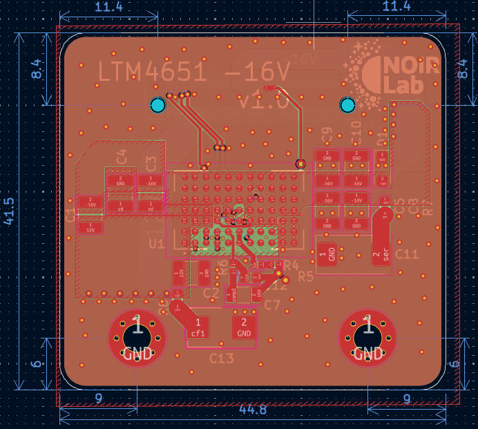
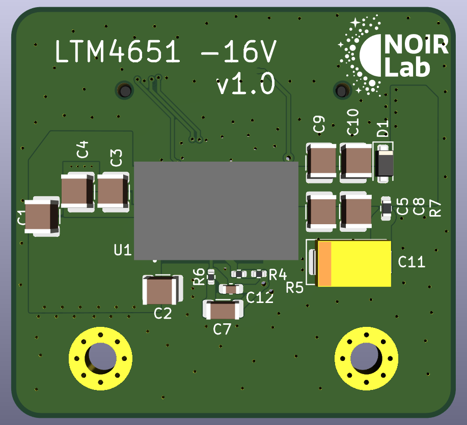

# mdc-power-n16-umodule
Modular Detector Controller Power -16V uModule

## Overview
12V input to -16V output DC-DC module, 0.5A nominal output, used as one of the `mdc-power-*` bias rails.
Designed for 2 MHz sync operation.

## Power Stage
- Controller: `LTM4651` (uModule)
  - Integrated µModule regulator including controller, MOSFETs, inductor, and support components.
  - EN55022B compliant regulator family (meets Class B EMI limits for conducted and radiated emissions).
  - External sync capability.

## Files
- Schematic: `power_n16_umodule.pdf`

## Board Dimensions
- 44.8 mm x 41.5 mm

## Board Stackup
- 4-layer PCB

## Interface
- Control pins: `EN` (enable) and `PG` / `~PGOOD` (power good).
- Connector: `LSHM-140-04.0-L-DV-A-N-K-TR` (Samtec LSHM series) mezzanine for power and control signals.
  - Common pinout is shared across the 16V, -16V, 6V, and 3.3V variants.
  - Unused output rails are tied to GND on the specific module variant.

## Images
Layout:

3D view:

